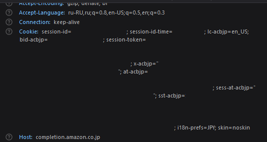
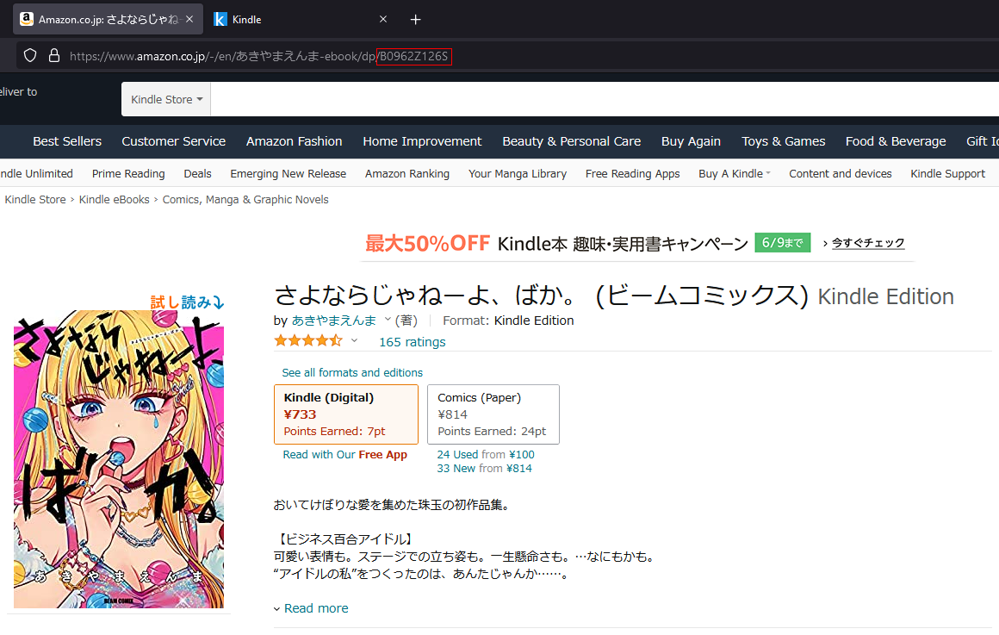
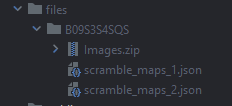

## Kindle Cloud Reader Parser/Scrapper
### Setup environment variables

First's lets setup environment variables.<br><br>
Open or create .env file, then we're going to [Amazon](https://amazon.co.jp) for get the cookies.
You can use special browser extensions, but I just go to Network Monitoring (Ctrl + Shift + E in Firefox) and select XHR's requests and copy from any request the **Cookie** header parameter.
<br>

<br>
I hide some Confidentiality parameters.
<br>
Now we're get a string like: `AMAZON_COOKIES=session-id=0-0-0; session-id-time=0; i18n-prefs=JPY;`
<br>
Let's put it to our .env file.

### Getting book code/id

Okay, all that's left is to get the CODE/ID of the book we want to download and that's it. That's pretty easy.


.env file setup now we can start downloading books.

```
npm run build
yarn build
```
```
# Then run start command with BOOK variable:
BOOK=B0962Z126S npm run start
BOOK=B0962Z126S yarn start
```
